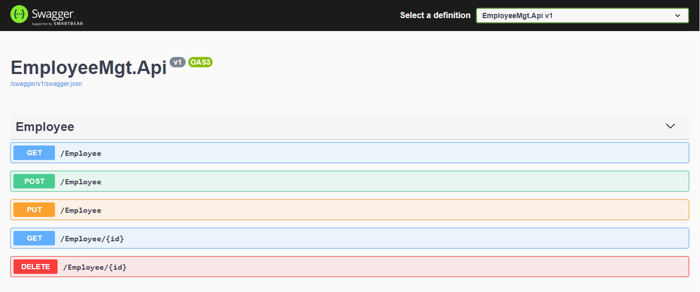
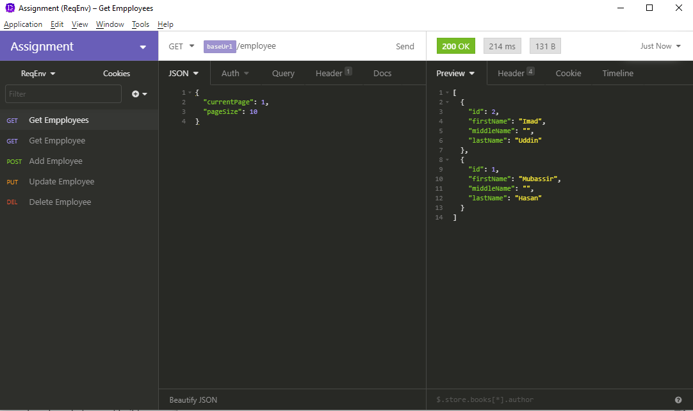

## For running this project you need to do some work

#### Visual Sutdio

* First thing first. Go to appsettings.json then change server name if your local server name is not '.'
* Go to Package Manager and select `Data` project then in console Console> run command `update-database`
* Hit `F5` to run this appplication

#### Tool Used to develop

* .Net Core 5.0

* Microsoft Visual Studio Community 2019 Version 16.9.2

  

## postman collection

[Download postman/insomnia collection](postmancollection/Insomnia_2021-06-29.json)

### Screen shoots

